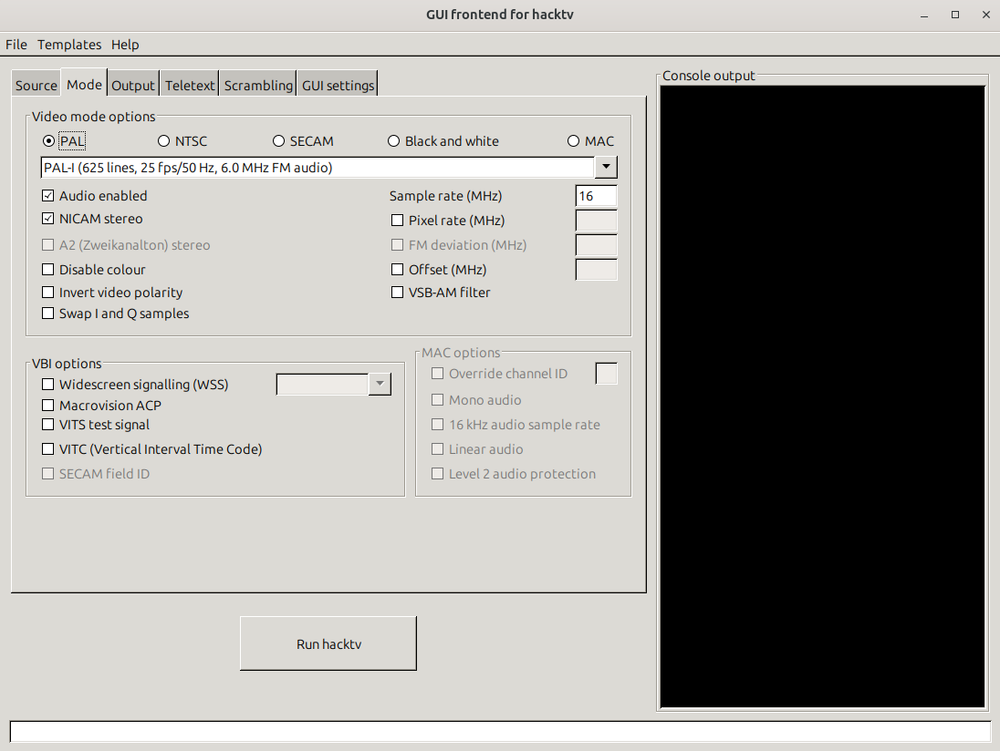

# Transmitting analog TV broadcasts with a hackrf 

To transmit analog TV signal we need:

- an old analog television
- a computer with a linux ( UBUNTU ) operating system
- hacktv software and hacktv-gui.jar for linux
- HackRF One PCB by Great Scott Gadgets (or a working clone)

## benefits

- analog television is cheap
- you only buy the reception device and you don't have to pay a subscription to receive the content
- zero lag, the signal is decoded almost instantly
- analog video transmission is used in drone racing


[EWRF 5.8Ghz 48CH 1000mW Adjustable Wireless AV](https://www.banggood.com/EWRF-5_8Ghz-48CH-1000mW-Adjustable-Wireless-AV-Built-in-Microphone-Transmitter-with-Starlight-CMOS-1000TVL-PAL-or-NTSC-Analog-FPV-Camera-for-RC-Racing-Drone-p-2000338.html?akmClientCountry=BE&cur_warehouse=CN&ID=6290726&rmmds=search&a=1718618883.2856&DCC=BE&currency=EUR)

## tips

- images produce emotions: they can make you happy or sad or they can influence your future decisions in life without you realizing it (eg: you see a coca cola commercial and you get thirsty and want to buy it)
- the information must be verified and the source verified (in mathematics, hypothesis, conclusion and demonstration)
- an old saying says that even if an authorized person comes (deep fake) and teaches you to do something illegal or bad, if he does not follow the rules or known laws, then it should not be taken as valid information.
- the eye can't get enough of watching (if you watch too many YouTube shorts you realize that you don't want to stop and you wake up as hours go by and you don't choose anything)

- C I A (secure the antenna)

## broadcast signal intrusion

A broadcast signal intrusion is the hijacking of broadcast signals of radio, television stations, cable television broadcast feeds or satellite signals without permission or licence.

https://en.wikipedia.org/wiki/Broadcast_signal_intrusion

## setup and install

Here you can find all the details to install all the necessary programs

https://github.com/steeviebops/hacktv-gui/wiki/Getting-started


open the UBUNTU linux terminal and


```
sudo apt update
```
```
sudo apt install openjdk-17-jre
```
```
sudo apt update
```
```
sudo apt install hacktv
```
download the GUI from 

https://github.com/steeviebops/hacktv-gui/releases 

To run hacktv-gui, run either the command below from the directory where hacktv-gui.jar is located:
```
java -jar hacktv-gui.jar
```




TX gain (db)


hit button `Run hacktv`

### References

https://github.com/steeviebops/hacktv-gui/wiki/Getting-started

https://en.wikipedia.org/wiki/Analog_television

https://www.rtl-sdr.com/transmitting-analog-tv-broadcasts-hackrf/

https://en.wikipedia.org/wiki/HackRF_One


